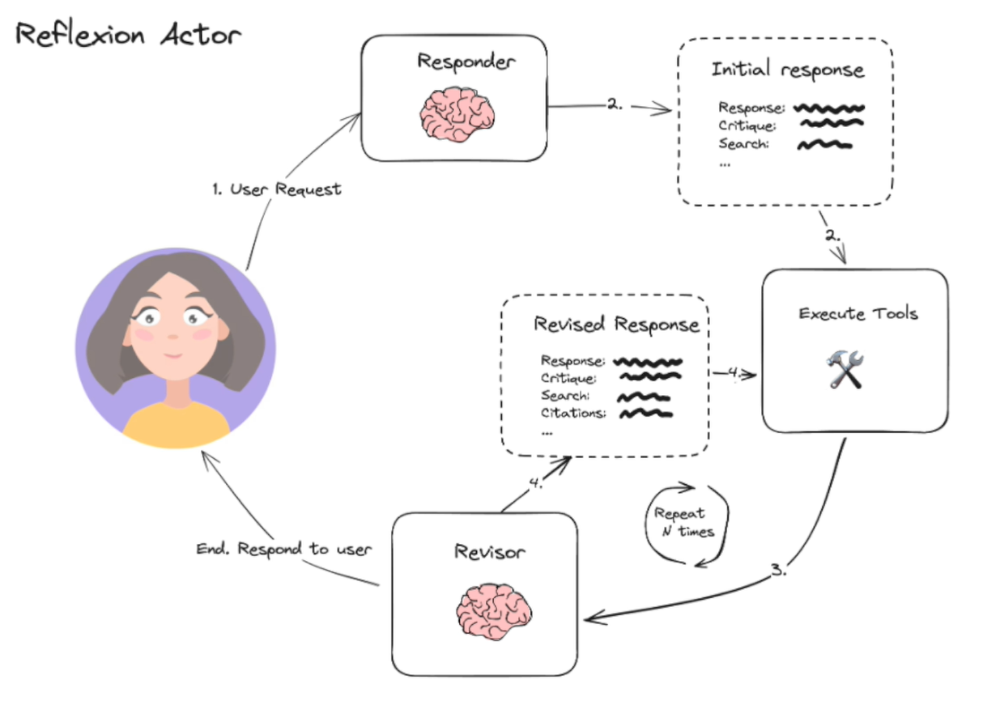

# Reflexion Agent

A minimal, inspectable **Reflexion-style research + self‑critique + revision agent** built with **LangGraph**, **LangChain**, OpenAI models, and the **Tavily** search API. It generates an initial answer, harshly critiques itself, emits targeted search queries, pulls in external evidence, and iteratively revises — up to a configurable iteration budget.


[](https://smith.langchain.com/o/856312b1-7816-4389-80cb-b01e398655be/projects/p/b2155aff-ef1a-46ae-b9a5-2607e5cdb310?timeModel=%7B%22duration%22%3A%227d%22%7D)


> **Status:** Educational / demo code. Not production‑hardened. Expect rough edges — the point is transparency.

---

## Table of Contents

1. [Why Reflexion?](#why-reflexion)
2. [Architecture Overview](#architecture-overview)
3. [Repository Structure](#repository-structure)
4. [Project Goals](#project-goals)
5. [Quickstart](#quickstart)
6. [Environment Variables](#environment-variables)
7. [LangGraph Workflow (Corrected)](#langgraph-workflow-corrected)
   * [Execution Loop](#execution-loop)
   * [Mermaid Sketch](#mermaid-sketch)
8. [Message Schema & Tool Calls](#message-schema--tool-calls)
9. [Running the Demo Scripts](#running-the-demo-scripts)
10. [File‑by‑File Guide](#file-by-file-guide)
11. [Extending / Hacking Ideas](#extending--hacking-ideas)
12. [References](#references)
13. [License](#license)

---

## Why Reflexion?

Traditional single‑shot LLM answers are often shallow or contain fabrications. **Reflexion** (Shinn et al., 2023) and related *reflection agents* show that prompting an LLM to **critique its own outputs, gather new evidence, and revise** can substantially improve answer quality on knowledge‑ and reasoning‑heavy tasks. LangChain’s blog post on *Reflection Agents* and the LangGraph tutorial notebook both walk through the core pattern this repo distills. ([arxiv.org](https://arxiv.org/abs/2303.11366?utm_source=chatgpt.com), [blog.langchain.com](https://blog.langchain.com/reflection-agents/?utm_source=chatgpt.com), [langchain-ai.github.io](https://langchain-ai.github.io/langgraph/tutorials/reflexion/reflexion/?utm_source=chatgpt.com))


**Reflexion Agent** uses a three‑stage loop to *self‑improve*:

| Stage            | Purpose                                                              |
| ---------------- | -------------------------------------------------------------------- |
| **Draft**        | Generate a first answer **plus** critique & search queries           |
| **Search Tools** | Execute the Tavily web‑search tool for each query                    |
| **Reviser**      | Integrate fresh evidence, apply the critique, and rewrite the answer |

The loop repeats until either the answer passes its own quality check or `MAX_ITERATIONS` (default = 3) is reached.

---

## Architecture Overview



The diagram shows the high‑level components that power the agent: prompt templates, structured tool calls, Tavily search, and the LangGraph event loop.

---

## Repository Structure

```text
reflexion_agent/
├── main.py                 # Entry point – builds & runs the LangGraph
├── chains.py               # Draft & Reviser prompt templates
├── tool_executor.py        # Tavily‑powered search ToolNode
├── schemas.py              # Pydantic schemas used for function calling
├── reflexion_agent.png     # Auto‑generated graph diagram
├── reflexion_actor.png     # High‑level architecture snapshot
├── pyproject.toml          # Min‑pinned dependencies (uv‑style)
└── uv.lock                 # Exact versions for reproducibility
```

---

## Project Goals

This repo demonstrates:

1. **Two‑stage Actor**: *First Responder* writes the initial \~250‑word answer *and* self‑reflection + search queries. *Reviser* rewrites using retrieved evidence, adds inline numeric citations, and trims to length. ([raw.githubusercontent.com](https://raw.githubusercontent.com/ndkhoa211/reflexion_agent/main/chains.py), [raw.githubusercontent.com](https://raw.githubusercontent.com/ndkhoa211/reflexion_agent/main/chains_reviser_print.py))
2. **Explicit Tooling Stage**: Search queries are run through Tavily via a LangGraph `ToolNode`; results are fed back to the Reviser. Separate tool names (`AnswerQuestion`, `ReviseAnswer`) make it easy to see which stage triggered which searches. ([raw.githubusercontent.com](https://raw.githubusercontent.com/ndkhoa211/reflexion_agent/main/tool_executor.py), [raw.githubusercontent.com](https://raw.githubusercontent.com/ndkhoa211/reflexion_agent/main/main.py))
3. **Iteration Budget**: The graph loops "Reviser ➜ execute\_tools" until a max tool‑invocation count (default **3**) is hit; then it terminates. This keeps demos fast and prevents infinite loops. ([raw.githubusercontent.com](https://raw.githubusercontent.com/ndkhoa211/reflexion_agent/main/main.py))
4. **Rich Console Debugging** demos to inspect raw tool calls, parsed Pydantic objects, and nicely formatted markdown panels. ([raw.githubusercontent.com](https://raw.githubusercontent.com/ndkhoa211/reflexion_agent/main/chains_responder_print.py), [raw.githubusercontent.com](https://raw.githubusercontent.com/ndkhoa211/reflexion_agent/main/chains_reviser_print.py))

---

## Quickstart

### 1. Clone & enter

```bash
git clone https://github.com/ndkhoa211/reflexion_agent.git
cd reflexion_agent
```

### 2. Create & activate env

You can use **uv** (fast, lockfile‑driven) *or* vanilla `pip`.

**uv**

```bash
uv sync  # creates .venv and installs from pyproject + uv.lock
source .venv/bin/activate  # or .venv\Scripts\activate on Windows
```

**pip**

```bash
python -m venv .venv
source .venv/bin/activate  # Windows: .venv\Scripts\activate
pip install -e .
```

Dependencies include `langchain`, `langgraph`, `langchain-openai`, `langchain-tavily`, `python-dotenv`, and `rich` (see *pyproject.toml*). ([raw.githubusercontent.com](https://raw.githubusercontent.com/ndkhoa211/reflexion_agent/main/pyproject.toml))

### 3. Set environment variables

Create a `.env` file (see next section) with your API keys, then run a demo:

```bash
python main.py
```

The script will build the graph, render a Mermaid PNG (`reflection_agent.png`), run a sample prompt, and pretty‑print the final answer. ([raw.githubusercontent.com](https://raw.githubusercontent.com/ndkhoa211/reflexion_agent/main/main.py))

---

## Environment Variables

This project loads credentials from a `.env` file at import time using `python-dotenv`. Provide at least:

```
OPENAI_API_KEY=sk-...
TAVILY_API_KEY=tvly-...
```

Optional (if you want LangSmith tracing):

```
LANGCHAIN_TRACING_V2=true
LANGCHAIN_API_KEY=lsv2-...
LANGCHAIN_PROJECT=Reflexion Agent
```

All top‑level scripts call `load_dotenv()` so the keys are read automatically when you run them. ([raw.githubusercontent.com](https://raw.githubusercontent.com/ndkhoa211/reflexion_agent/main/main.py), [raw.githubusercontent.com](https://raw.githubusercontent.com/ndkhoa211/reflexion_agent/main/tool_executor.py), [raw.githubusercontent.com](https://raw.githubusercontent.com/ndkhoa211/reflexion_agent/main/chains.py))

---

## LangGraph Workflow

**High‑level:**

1. **draft** *(First Responder)* — prompt template asks for \~250‑word answer **+ severe critique + 1‑3 search queries**. Output is emitted via a tool call shaped by the `AnswerQuestion` schema. ([raw.githubusercontent.com](https://raw.githubusercontent.com/ndkhoa211/reflexion_agent/main/chains.py), [raw.githubusercontent.com](https://raw.githubusercontent.com/ndkhoa211/reflexion_agent/main/schemas.py))
2. **execute\_tools** — LangGraph `ToolNode` that inspects the latest LLM message and executes any tool calls. Two *functionally identical* search tools are registered, but with *different names* (`AnswerQuestion`, `ReviseAnswer`) so you can see which stage requested which search. Uses Tavily’s search API under the hood. Results are appended to the message state as `ToolMessage`s. ([raw.githubusercontent.com](https://raw.githubusercontent.com/ndkhoa211/reflexion_agent/main/tool_executor.py), [raw.githubusercontent.com](https://raw.githubusercontent.com/ndkhoa211/reflexion_agent/main/main.py))
3. **reviser** — Prompt template re‑uses the actor scaffold but swaps in *revision instructions*: incorporate critique + new evidence, trim, add inline numeric citations, and append a References list. Emits a `ReviseAnswer` tool call (schema extends `AnswerQuestion` w/ `reference` list). ([raw.githubusercontent.com](https://raw.githubusercontent.com/ndkhoa211/reflexion_agent/main/chains.py), [raw.githubusercontent.com](https://raw.githubusercontent.com/ndkhoa211/reflexion_agent/main/chains_reviser_print.py), [raw.githubusercontent.com](https://raw.githubusercontent.com/ndkhoa211/reflexion_agent/main/schemas.py))
4. **Loop / Stop** — A conditional edge from **reviser** counts the number of `ToolMessage`s (i.e., how many search batches have run). If that count exceeds `MAX_ITERATIONS` (default 3), the graph routes to `END`; otherwise it routes back to **execute\_tools** for another evidence fetch + revision cycle. **Note:** The loop does *not* examine critique quality; it’s purely an iteration budget in current code. ([raw.githubusercontent.com](https://raw.githubusercontent.com/ndkhoa211/reflexion_agent/main/main.py))

### Execution Loop

Initial pass includes the *draft* node; subsequent passes skip it — cycles are strictly **reviser ⇄ execute\_tools** after the first draft. This corrects earlier docs that implied the *draft* node was re‑invoked each round. ([raw.githubusercontent.com](https://raw.githubusercontent.com/ndkhoa211/reflexion_agent/main/main.py))

---

## Message Schema & Tool Calls

Both actor stages use **OpenAI tool calling** bound to **Pydantic models** so we always get structured outputs:

* **Reflection**: `{missing: str, superfluous: str}` — critique buckets. ([raw.githubusercontent.com](https://raw.githubusercontent.com/ndkhoa211/reflexion_agent/main/schemas.py))
* **AnswerQuestion**: `{answer: str, reflection: Reflection, search_queries: List[str]}` — emitted by *draft*. ([raw.githubusercontent.com](https://raw.githubusercontent.com/ndkhoa211/reflexion_agent/main/schemas.py))
* **ReviseAnswer**: **inherits AnswerQuestion** and adds `reference: List[str]` for source links cited in the revision. ([raw.githubusercontent.com](https://raw.githubusercontent.com/ndkhoa211/reflexion_agent/main/schemas.py))

During tool execution, the *search\_queries* list is fed to Tavily; results come back batched. Labeling the two StructuredTools lets you audit whether a query originated from the initial draft or a later revision cycle. ([raw.githubusercontent.com](https://raw.githubusercontent.com/ndkhoa211/reflexion_agent/main/tool_executor.py))

---

## Running the Demo Scripts

You have three entry points:

| Script                      | What it Shows                                                                                                                                | Typical Use                                                                                                                                             |
| --------------------------- | -------------------------------------------------------------------------------------------------------------------------------------------- | ------------------------------------------------------------------------------------------------------------------------------------------------------- |
| `main.py`                   | Full multi‑iteration graph, generates Mermaid PNG, final answer pretty‑printed.                                                              | End‑to‑end test / demo. ([raw.githubusercontent.com](https://raw.githubusercontent.com/ndkhoa211/reflexion_agent/main/main.py))                         |
| `chains_responder_print.py` | Stand‑alone *First Responder* demo; inspect raw tool call → parsed answer / reflection / queries with Rich.                                  | Debug prompting & schema. ([raw.githubusercontent.com](https://raw.githubusercontent.com/ndkhoa211/reflexion_agent/main/chains_responder_print.py))     |
| `chains_reviser_print.py`   | Responder **then** Reviser walkthrough; raw tool calls, parsed objects, final answer + references; robust parsing fallback if schema drifts. | Debug revision & refs pipeline. ([raw.githubusercontent.com](https://raw.githubusercontent.com/ndkhoa211/reflexion_agent/main/chains_reviser_print.py)) |

Run any script directly, e.g.:

```bash
python chains_responder_print.py
```

---

## File‑by‑File Guide

### `chains.py`

Defines the shared actor prompt template; builds **first\_responder** (AnswerQuestion tool) and **reviser** (ReviseAnswer tool) chains; lightweight demo in `__main__` that invokes the responder chain. ([raw.githubusercontent.com](https://raw.githubusercontent.com/ndkhoa211/reflexion_agent/main/chains.py))

### `tool_executor.py`

Wraps a Tavily search tool; registers **two StructuredTools** (named after `AnswerQuestion` & `ReviseAnswer`) so search origin is traceable in logs; exposes `execute_tools` LangGraph `ToolNode` that batches queries. ([raw.githubusercontent.com](https://raw.githubusercontent.com/ndkhoa211/reflexion_agent/main/tool_executor.py))

### `schemas.py`

Pydantic data models that *shape all tool outputs*: `Reflection` (missing / superfluous), `AnswerQuestion` (answer + reflection + search\_queries), and `ReviseAnswer` (extends AnswerQuestion w/ `reference` list). These schemas drive tool‑call argument validation and downstream parsing. ([raw.githubusercontent.com](https://raw.githubusercontent.com/ndkhoa211/reflexion_agent/main/schemas.py))

### `main.py`

Assembles the 3‑node LangGraph (`draft`, `execute_tools`, `reviser`), sets `MAX_ITERATIONS = 3`, wires the conditional loop, compiles, draws `reflection_agent.png`, and runs a sample query then prints the final answer in a Rich panel. ([raw.githubusercontent.com](https://raw.githubusercontent.com/ndkhoa211/reflexion_agent/main/main.py))

### `chains_responder_print.py`

Interactive console demo of the *First Responder* stage; shows raw JSON tool call (no truncation), parsed Pydantic object, and nicely formatted panels for answer, reflection buckets, and search queries. ([raw.githubusercontent.com](https://raw.githubusercontent.com/ndkhoa211/reflexion_agent/main/chains_responder_print.py))

### `chains_reviser_print.py`

Full Responder → Reviser walkthrough; includes schema‑drift‑tolerant parsing and pretty panels for references. Good for debugging how revision instructions affect outputs. ([raw.githubusercontent.com](https://raw.githubusercontent.com/ndkhoa211/reflexion_agent/main/chains_reviser_print.py))

### `reflection_agent.png` & `reflexion_actor.png`

Static diagrams auto‑exported / illustrative of the flow. Regenerate by running `main.py`. ([raw.githubusercontent.com](https://raw.githubusercontent.com/ndkhoa211/reflexion_agent/main/main.py))

### `pyproject.toml`

Project metadata + dependency pins; installable as a package; Python 3.12+. ([raw.githubusercontent.com](https://raw.githubusercontent.com/ndkhoa211/reflexion_agent/main/pyproject.toml))

---

## Extending / Hacking Ideas

* **Adaptive stopping:** Inspect the Reviser’s reflection; stop early if no missing items.
* **Score‑based gating:** Ask Reviser to score confidence; loop until threshold.
* **Multi‑tool evidence:** Add web scraping, ArXiv search, or code execution tools; differentiate by stage.
* **Memory buffer:** Persist reflections across unrelated questions to build a knowledge base.
* **Streaming UI:** Use `graph.stream()` to update a live TUI instead of waiting for completion. (Starter code in the print demo scripts.) ([raw.githubusercontent.com](https://raw.githubusercontent.com/ndkhoa211/reflexion_agent/main/chains_reviser_print.py), [raw.githubusercontent.com](https://raw.githubusercontent.com/ndkhoa211/reflexion_agent/main/chains_responder_print.py))

---

## References

* Shinn, N. *et al.* **Reflexion: Language Agents with Verbal Reinforcement Learning** (2023). arXiv:2303.11366. ([arxiv.org](https://arxiv.org/abs/2303.11366?utm_source=chatgpt.com))
* LangChain Blog — **Reflection Agents** (LangGraph examples incl. Reflexion). ([blog.langchain.com](https://blog.langchain.com/reflection-agents/?utm_source=chatgpt.com))
* LangGraph Docs — **Reflexion Tutorial**. ([langchain-ai.github.io](https://langchain-ai.github.io/langgraph/tutorials/reflexion/reflexion/?utm_source=chatgpt.com))

---

*Let me know what to tweak — wording, code snippets, screenshots, or additional setup steps.*


---
## License

[MIT](LICENSE) – free to adapt, remix, and build upon.

Happy reflecting! 🚀
